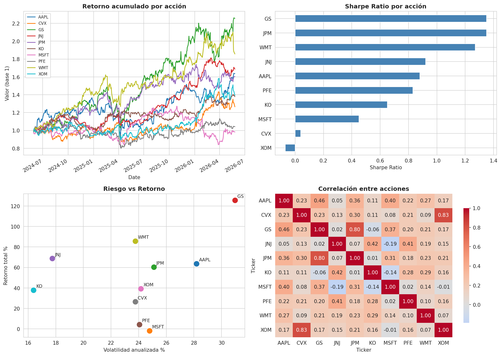

# Risk-Adjusted Return Analysis: S&P 500 Sectors

Analysis of 10 S&P 500 stocks across 5 sectors to identify the best risk-adjusted return opportunities over the last 2 years.

## Business Question

Which sectors offer the best risk-return relationship for portfolio allocation decisions?

## Methodology

I analyzed daily price data from Yahoo Finance covering 10 large-cap stocks grouped into 5 sectors: Technology, Financials, Healthcare, Energy, and Consumer Goods.

For each stock and sector, I calculated:

- **Total Return** — Cumulative percentage return over the period
- **Annualized Volatility** — Standard deviation scaled by √252 trading days
- **Sharpe Ratio** — Risk-adjusted return using 4% risk-free rate
- **Maximum Drawdown** — Largest peak-to-trough decline
- **Correlation Matrix** — For diversification analysis

## Key Findings

The analysis ranks sectors by Sharpe ratio, identifying which offered the best return per unit of risk. Correlation analysis reveals diversification opportunities across sectors.

## Tech Stack

- **Python** — pandas, numpy for data manipulation
- **yfinance** — Market data acquisition
- **matplotlib, seaborn** — Visualization
- **Jupyter / Google Colab** — Analysis environment

## Files

- `StocksSP500.ipynb` — Full analysis notebook
- `resumen_acciones.csv` — Per-stock metrics
- `ranking_sectores.csv` — Per-sector aggregated metrics
- `retornos_diarios.csv` — Daily returns dataset
- `retornos_acumulados.csv` — Cumulative returns
- `analisis_sectores.png` — Visualization dashboard

## About

Built as part of my transition into Business Analytics, applying my finance background (derivatives trading, quantitative finance) to data analysis projects.
